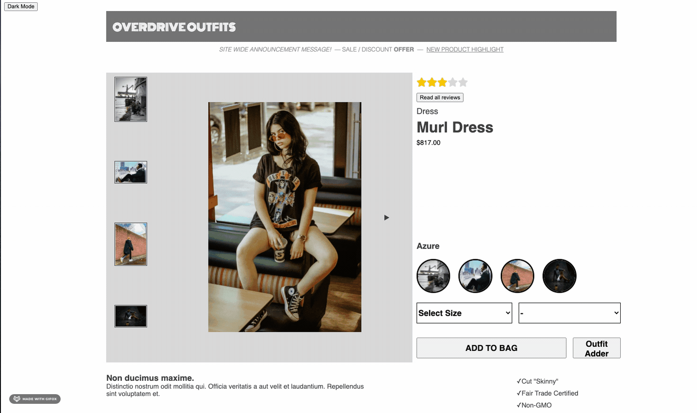
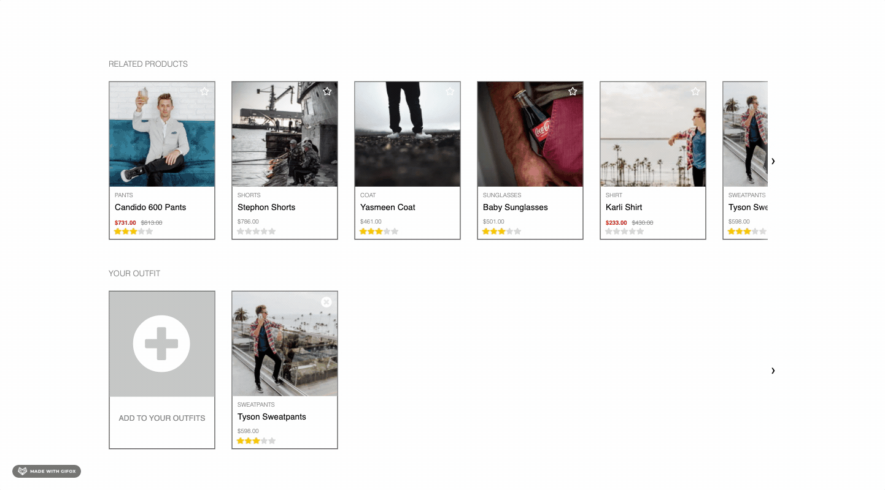
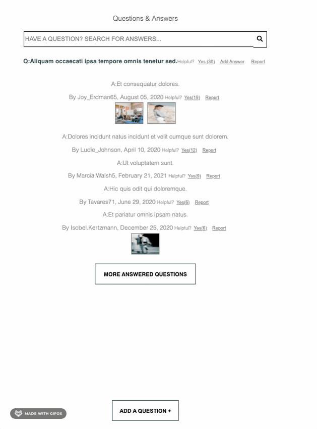
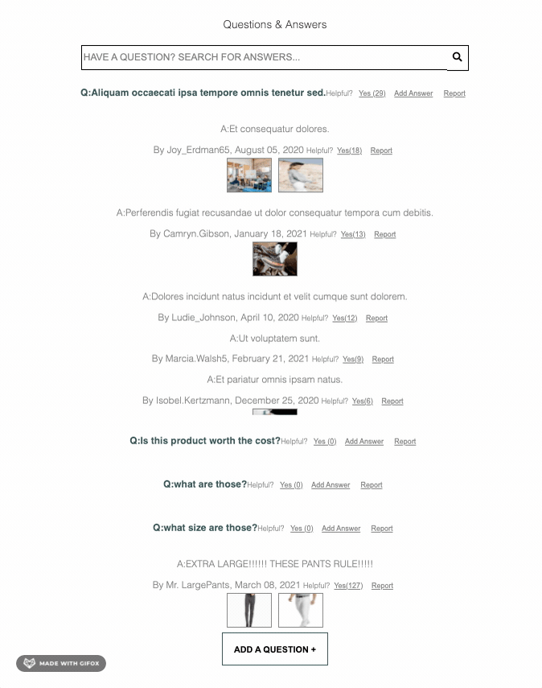
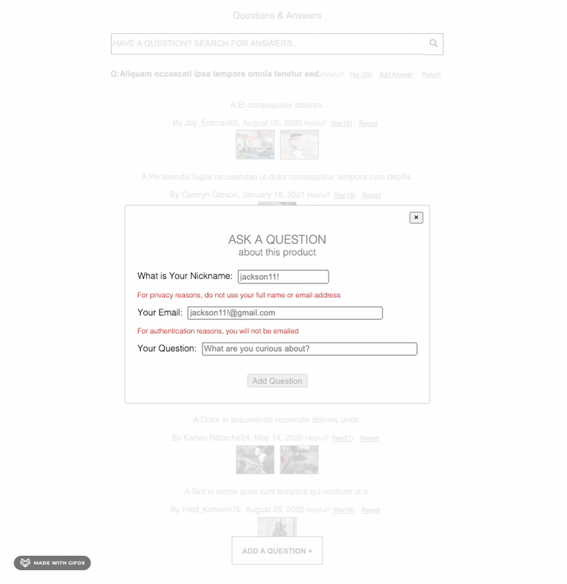
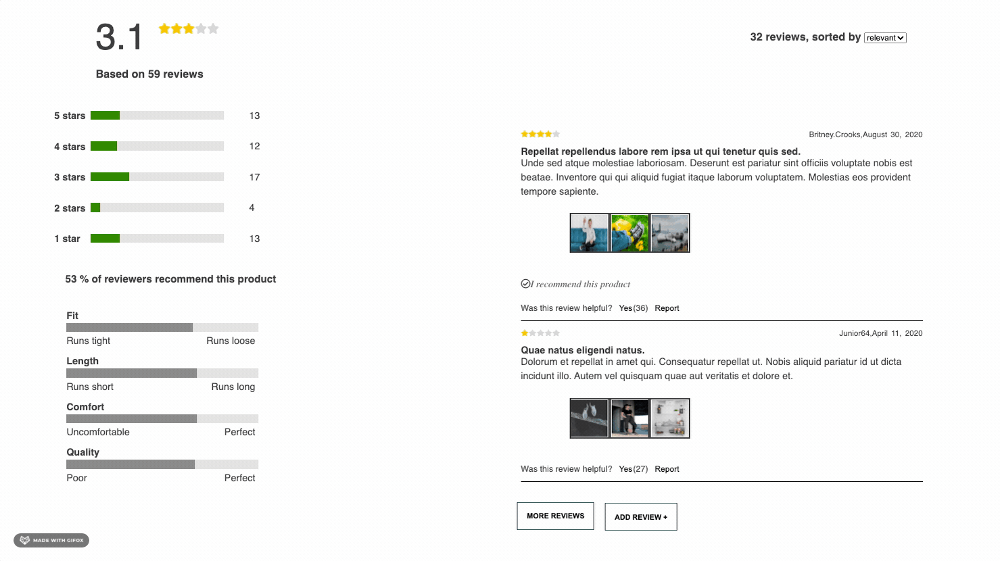
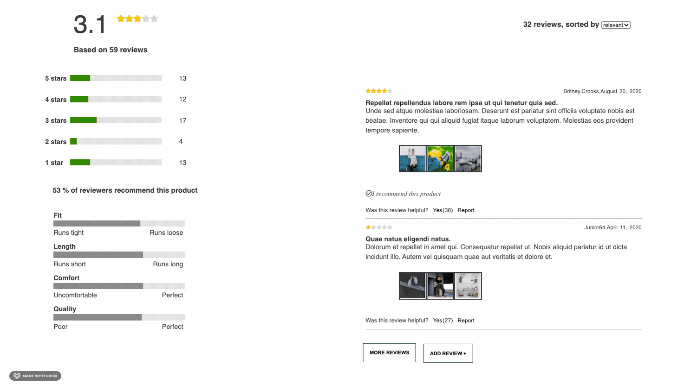
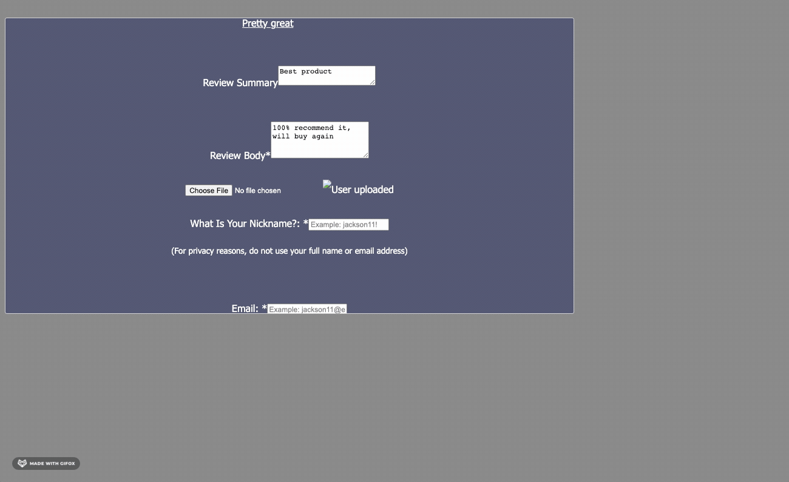

<h1 align="center"> Overdrive Outfits </h1>

<h2>Components and Contributers</h2>

Product Overview: [Alex Duncan](https://github.com/monkeymedic26 "Alex Duncan")  
Ratings & Reviews: [Sheeba Nair](https://github.com/sheebanair "Sheeba Nair")  
Questions & Answers: [Eric Hernandez](https://github.com/EricMHernandez "Eric Hernandez")  
Related Products & Your Outfit: [Dani Tian](https://github.com/danitian "Dani Tian")  

<h2>Introduction</h2>
Overdrive Outfits is a single-page e-commerce webapp for clothing and accessories, built with service-oriented architecture.

The app includes:
- An overview with general product information and images
- A related products section to compare related items
- A your outfits section to add products to a user's personal outfit list
- A question and answers section to ask questions and view responses to past questions
- A ratings and reviews section to see the overall rating and past reviews of the product
- Click tracking across the app to track user interactions in a database for future business analytics

<h2>Tech Stack</h2>

<ul>
<li>React</li>
<li>Express</li>
<li>Node.js</li>
<li>Axios</li>
<li>Styled Components</li>
<li>Jest</li>
<li>React Testing Libraries</li>
<li>MySQL</li>
<li>AWS</li>
<li>Webpack</li>
<li>Babel</li>
<li>Compression</li>
</ul>

<h2>User Stories</h2>

<ul>
<li>As a user, I should be able to toggle between light and dark mode for the entire page</li>
<li>As a user, I would like to see a product displayed with an image carousel and a navigation button to go to the next/previous image</li>
<li>As a user, I should be able to select different styles of the same product and have the images, size and quantities render accordingly</li>
<li>As a user, I should be able to scroll directly to the ratings section by clicking on the star rating component displayed at the top of each product display</li>
<li>As a user, I should be able to click on the related products and have the information display for the selected product, for all sections</li>
<li>As a user, I should be able to click on the star for each related product and have a card display comparison of characteristics between the current product and selected product</li>
<li>As a user, I should have questions displayed in the questions and answers component. There should be a 'more questions' button to display all questions in a scrollable view and each question should have all potential answers displayed</li>
<li>As a user, I should be able to report a question/answer to be helpful or unhelpful. Flagged questions/answers will be removed from display</li>
<li>As a user, I should be able to ask a new question without having to login or create an account</li>
<li>As a user, I should be able to see all the relevant reviews for a products and having a ratings section displayed on the side which assesses the number of stars given to a product as well as rating for each associated charactersitic of the product</li>
<li>As a user, I should also be able to see an average rating as a number and a star rating component, as well as the total number of reviews and people who recommend the product</li>
<li>As a user, I should be able to sort the reviews to display in the order of my preference, bu date, relevance or helpfulness </li>
<li>As a user, I should be able to see more than 2 reviews when clicking on the 'More reviews' button in a scrollable view</li>
<li>As a user, I should be able to report a review or mark it helpful. Reported reviews will be removed from display</li>
<li>As a user, I should be able to submit a new review and have that review displayed at the top of the list, when sorted with the 'newest' sort option</li>
</ul>

<h2>Requirements</h2>

<h3>Installing Dependencies</h3>

From within the root directory: 
`npm install`

<h2>Development</h2>

From within the root directory:

To run server 
`npm start`

To run webpack build 
`npm run build`

To run webpack watch 
`npm run watch`

To run tests 
`npm test`
 
<h2>App Demo</h2>

# <h4>Product Overview & Related Products:</h4>

 

 

 

 
 

# <h4>Questions & Answers:</h4>

 

 

 
 

# <h4>Ratings and Reviews:</h4>

 

 

 

